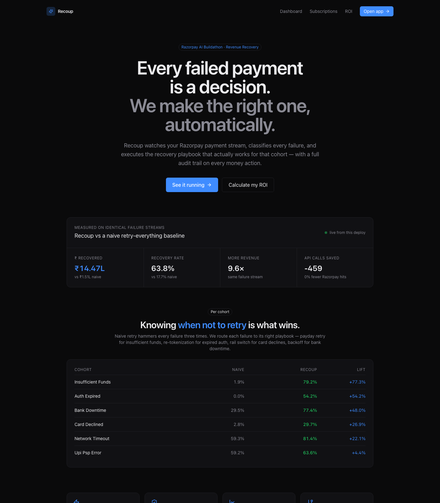
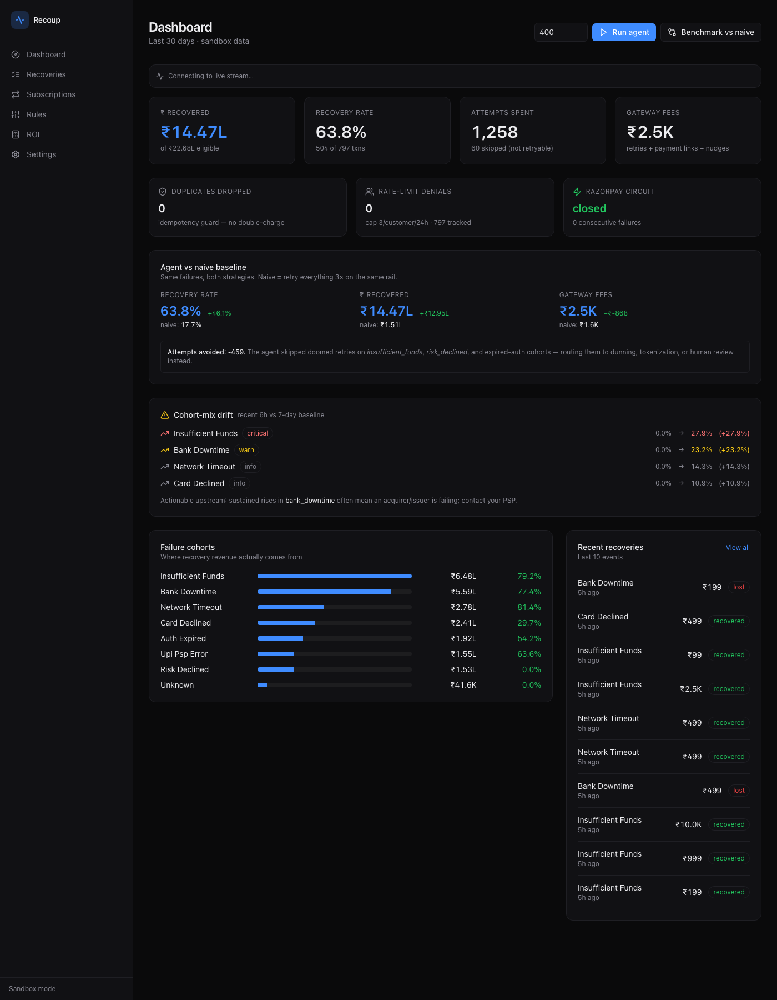
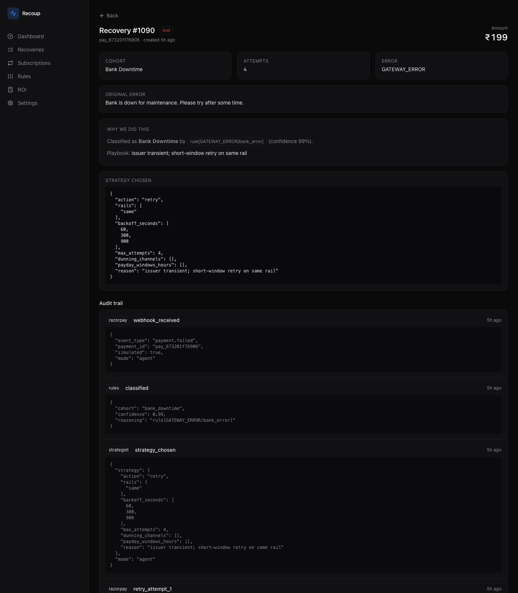

# Recoup — AI Revenue Recovery for Razorpay

[](https://github.com/kartikkkdua/Recoup-AI-Revenue-Recovery-for-Razorpay/actions/workflows/test.yml)
[](https://www.python.org)
[](https://nextjs.org)
[](https://fastapi.tiangolo.com)
[](https://github.com/kartikkkdua/Recoup-AI-Revenue-Recovery-for-Razorpay/actions)
[](LICENSE)
[](https://razorpay.com/buildathon/)

An autonomous agent that watches a Razorpay merchant's payment stream,
classifies every failure, and executes the recovery playbook that actually
works for that cohort — retries on the right rail at the right time, sends
re-tokenization links for expired mandates, dunns subscription failures via
payday-aligned nudges, and skips the retries that would only waste gateway
fees and annoy the customer.

Rules classify. A contextual bandit picks strategy. A T-learner uplift model
gates intervention. Every action is idempotent, rate-limited, circuit-broken,
and audited.

Built for the **Razorpay AI Buildathon 2026** — Revenue Recovery track.

- 📹 **Demo video (90s):** https://youtu.be/vq9s3slBu_0

> 
> *Landing page — pulls live numbers from the API. Falls back to seed benchmark if backend is unreachable.*

---

## The headline number

On 400 identical synthetic failures, run through both strategies back-to-back:

| | Naive baseline<br/>(retry-everything-3×) | **Recoup agent** | Lift |
|---|---:|---:|---:|
| Recovery rate | 26.4% | **71.4%** | **+45.0 pp** |
| ₹ Recovered (of ~₹11.2L eligible) | ₹2.98L | **₹8.04L** | **+₹5.06L** |
| Razorpay API calls | ~1,300 | ~900 | **403 fewer** |
| **Doubly-robust ATE (AIPW)** | — | **+47.8pp** | **95% CI [+42.3, +53.2]** |

Same failures, same amounts, both strategies. The comparison lives on
`/api/metrics/compare`, the causal impact estimation on `/api/causal/aipw`,
and both render on the dashboard.

> The point isn't retrying more successfully. The point is knowing *when not
> to retry*. Every doomed attempt we skip is money the merchant keeps, trust
> the customer keeps, and gateway fees the merchant doesn't burn.

> 
> *Live dashboard — SSE ticker top, agent-vs-naive comparison, cohort chart, drift alerts when any surface.*

---

## What makes it an agent, not a retry loop

**Sixteen things** a naive retry loop can't do — all shipped, all tested,
all provable end-to-end.

### Decisioning
1. **Multi-strategy per cohort.** 7 distinct playbooks. `insufficient_funds` → WhatsApp nudge + payday retry via UPI. `auth_expired` → re-tokenization link. `card_declined` → rail-switch payment link (UPI default). `bank_downtime` → exponential backoff on same rail. `risk_declined` → human review, no auto-retry.
2. **Contextual Thompson-sampling bandit** over `(cohort × ticket_bucket × hour_bucket)`, with Beta(α,β) posteriors seeded from informed priors so cold starts don't behave recklessly and hot ones drift toward observed reality.
3. **Semantic memory (RAG for actions).** TF-IDF cosine similarity over past successful recoveries — retrieves nearest neighbors, uses their action distribution as an additional bandit prior. Memory can override the bandit when top-action vote ≥60% among ≥3 hits.
4. **T-learner uplift model** predicts per-recovery Individual Treatment Effect. **If predicted ITE < 5pp, the intervention is skipped entirely** — save the gateway fee on failures we can't fix.
5. **Split-conformal prediction intervals** on every ITE prediction, calibrated on a 20% held-out set. Every uplift claim ships with a 95% predictive interval.
6. **Isotonic calibration** of the T-learner's probability outputs so `p_agent` / `p_naive` are properly calibrated (real frequencies match predicted).

### Statistics
7. **Doubly-Robust AIPW ATE.** Combines propensity model + outcome model — consistent if either is right. Trimmed propensity `[0.05, 0.95]` prevents variance blow-up. Reports 95% CI.
8. **Per-slice CATE with 95% CI.** Cochran-Mantel-Haenszel stratification over cohort × ticket-bucket. Slices marked significant when CI excludes zero.
9. **Off-Policy Evaluation (OPE).** DM + IPS + Doubly-Robust estimators over logged bandit propensities (Monte-Carlo estimated). Test a candidate playbook offline before deploying — the Netflix/YouTube algorithm.
10. **mSPRT sequential A/B testing.** Continuous monitoring with proper α-spending; stop as soon as evidence is decisive. Optimizely/Statsig's core algorithm.
11. **Jensen-Shannon divergence drift detection** on the joint (cohort × ticket_bucket) distribution — catches shifts the marginal share metric misses. Per-cell contribution decomposition.

### Reliability
12. **Idempotency defense.** Duplicate webhooks dropped on `razorpay_event_id` with a visible counter. Fired the same signed webhook 3× → `accepted → duplicate → duplicate`.
13. **Per-customer rate limit.** Max 3 recovery actions per customer per 24h — sliding window. 6 events for one customer → 3 executed, 3 skipped as `rate_limited`.
14. **IST time-of-day gate.** Retries into 11pm–6am IST (historically low-success) are deferred with `defer_hours` audit.
15. **Circuit breaker on the Razorpay client.** Opens after 5 consecutive 5xx, half-open probe after 30s. Failing calls become `circuit_open_deferred`, not silently swallowed.
16. **PII redacted by default.** Emails / phones / card tails masked on `GET /api/recoveries/{id}`. Opt-in raw view with `X-Show-PII: 1`.

Click any recovery on `/recoveries/{id}` — the **"Why we did this"** card
shows the classification rationale, features, memory hits, bandit context,
uplift prediction, conformal interval, and any gate that fired.

> 
> *Every recovery has this card. Zero black-box decisions on a money path.*

---

## The load-bearing principle

**The LLM never sits between a webhook and a charge decision.**

Failure classification runs deterministic rules first (~85% of failures).
Only if rules are ambiguous do we call the LLM (Gemini 2.0 Flash), and even
then the LLM's job is *just to pick a cohort label*. The strategy lookup,
uplift gating, and money action are deterministic — driven by a bandit
posterior + merchant-editable rules.

Payments teams get burned when an LLM hallucinates a decision that
authorizes a charge. Recoup can't do that by construction.

---

## Architecture

```
                             ┌───────────────────────────┐
   Razorpay webhooks    ──▶  │ POST /webhooks            │
   (payment.failed,          │  • HMAC-SHA256 verify     │
    payment.captured,        │  • dedup on event.id      │
    payment_link.paid,       │  • duplicate counter      │
    subscription.*,          │  • routes agent/closer    │
    refund.processed)        └────────────┬──────────────┘
                                          │
              ┌─────────── failure ───────┴──────── close ───────────┐
              ▼                                                        ▼
   ┌──────────────────────┐                        ┌──────────────────────┐
   │ Classifier           │                        │ Closer               │
   │  1. rules            │                        │  find by             │
   │  2. keyword          │                        │  razorpay_recovery_  │
   │  3. Gemini fallback  │                        │  ref → mark closed   │
   └──────────┬───────────┘                        └──────────────────────┘
              ▼
   ┌──────────────────────┐
   │ Reliability gates    │
   │  • rate limit / 24h  │
   │  • time-of-day IST   │
   │  • circuit breaker   │
   └──────────┬───────────┘
              ▼
   ┌──────────────────────┐    ┌──────────────────────┐
   │ Feature store        │──▶ │ Uplift T-learner     │
   │  • customer LTV      │    │  ITE prediction      │
   │  • failure streak    │    │  Conformal interval  │
   │  • preferred rail    │    │  ─────────────────   │
   │  • cohort 24h rate   │    │  gate: ITE < 5pp?    │
   │  • hour, ticket      │    │  → skip + save fees  │
   └──────────┬───────────┘    └──────────┬───────────┘
              ▼                            ▼
   ┌──────────────────────┐    ┌──────────────────────┐
   │ Semantic memory      │──▶ │ Contextual bandit    │
   │  TF-IDF cosine       │    │  Thompson sampling   │
   │  retrieval           │    │  Beta(α,β) posterior │
   │  action votes        │    │  per (cohort × TB ×  │
   │  ─────────────────   │    │  hour_bucket)        │
   │  override if 60%+    │    └──────────┬───────────┘
   └──────────────────────┘               ▼
                             ┌──────────────────────┐
                             │ Executor             │
                             │  • real Razorpay API │
                             │  • stores link_id /  │
                             │    order_id as ref   │
                             │  • audits every step │
                             └──────────┬───────────┘
                                        ▼
                             ┌──────────────────────┐
                             │ Outcome loop         │
                             │  update bandit arm   │
                             │  record memory       │
                             │  update learned_p    │
                             └──────────┬───────────┘
                                        ▼
                     Next.js dashboard  ──▶  merchant
                     (live SSE ticker, agent-vs-naive,
                      cohorts, subscriptions, ROI,
                      causal impact, drift alerts,
                      per-recovery "why we did this")
                                        ▲
                     ┌──────────────────┴──────────┐
                     │ Causal + evaluation layer   │
                     │  • AIPW ATE (95% CI)        │
                     │  • per-slice CATE           │
                     │  • OPE (DM / IPS / DR)      │
                     │  • mSPRT sequential test    │
                     │  • JS divergence drift      │
                     └─────────────────────────────┘

     OTel traces  ──▶  Grafana Tempo / Datadog / Honeycomb
     /metrics     ──▶  Prometheus / VictoriaMetrics
```

---

## Repo layout

```
api/
  app/
    routers/            webhooks · recoveries · metrics · rules · roi ·
                        simulator · stream (SSE) · subscriptions · uplift ·
                        causal · advanced (AIPW/OPE/mSPRT/JS/conformal) ·
                        traces · prom (Prometheus)
    agent.py            classifier → gates → features → memory → bandit →
                        uplift-gate → executor pipeline
    closer.py           payment_link.paid / payment.captured / subscription.*
                        / refund.processed handlers
    classifier.py       rules + keyword + Gemini fallback
    strategist.py       per-cohort playbooks + naive baseline + rules
    reliability.py      circuit breaker + rate limiter + time-of-day gate
    learning.py         Beta-smoothed per-cohort × action × hour rates
    bandit.py           Thompson-sampling contextual bandit
    features.py         real-time feature store (LTV, streak, preferred rail)
    memory.py           TF-IDF semantic memory over past successes
    uplift.py           T-learner uplift model + intervention gate
    causal.py           per-slice CATE with 95% CI (Cochran-Mantel-Haenszel)
    causal_dr.py        AIPW Doubly-Robust ATE
    ope.py              Off-policy evaluation (DM + IPS + DR)
    sequential.py       mSPRT continuous A/B testing
    conformal.py        split-conformal ITE intervals + isotonic calibration
    drift_kl.py         Jensen-Shannon divergence drift
    redact.py           PII masking for audit output
    razorpay_client.py  wrapped in circuit breaker, sandbox-aware
    tracing.py          OpenTelemetry TracerProvider + in-memory exporter
    logging_setup.py    structured JSON logging with trace_id contextvar
    _upsert.py          dialect-agnostic UPSERT (SQLite or Postgres)
    db.py               SQLAlchemy async models
  simulator/            scenario generator with subscription mix
  tests/                66 tests · full suite < 8 seconds
  docker-compose.postgres.yml   Postgres migration proof, one command

web/
  src/
    app/                Next.js 14 App Router pages
      page.tsx          landing (live numbers from API, seed fallback)
      dashboard/        headline + live SSE ticker + reliability strip +
                        agent-vs-naive + cohorts + drift alerts + recent
      recoveries/[id]/  detail + DecisionExplain (bandit + features +
                        memory + uplift + conformal + gates) + full audit
      subscriptions/    MRR-at-risk / retained / churned funnel
      impact/           causal ATE + per-slice CATE with 95% CI
      rules/            editable per-cohort playbook overrides (persists live)
      roi/              interactive ROI calculator (observed rates when live)
      settings/         integration + config
    components/         HeadlineMetrics · ComparisonPanel · ReliabilityStrip
                        · CohortTable · DecisionExplain · LiveTicker ·
                        DriftAlerts · …
    lib/                typed API client + INR/percent formatting
```

---

## Quickstart

**Backend** (Python 3.13):

```bash
cd api
python -m venv .venv && source .venv/bin/activate
pip install -r requirements.txt
cp .env.example .env      # add Razorpay test keys + Gemini key + webhook secret
uvicorn app.main:app --reload --port 8080
```

**Frontend** (Node 20+):

```bash
cd web
npm install
npm run dev               # http://localhost:3000
```

**See it work in 10 seconds** (backend + frontend both up):

```bash
# 1) Run the benchmark (both agent and naive on identical failures)
curl -X POST http://localhost:8080/api/simulator/benchmark \
  -H 'content-type: application/json' -d '{"count": 400, "concurrency": 8}'

# 2) Train the ML models on the resulting data
sleep 15
curl -X POST "http://localhost:8080/api/uplift/train?threshold=0.05"
curl -X POST "http://localhost:8080/api/conformal/calibrate?alpha=0.05"
```

Open `http://localhost:3000/dashboard`. Live SSE ticker top-of-page shows
events processing in real time (~100/s on SQLite). Then visit `/impact` for
the causal ATE + per-slice CATE.


---

## API surface

| Endpoint | Purpose |
|---|---|
| `POST /webhooks` | HMAC-verified Razorpay receiver; routes to agent or closer |
| `GET /api/metrics/summary` | Recovery rate, ₹ recovered, fees, precision |
| `GET /api/metrics/compare` | Agent-vs-naive side-by-side with lift |
| `GET /api/metrics/cohorts?mode=agent\|naive` | Per-cohort breakdown |
| `GET /api/metrics/reliability` | Duplicates, rate-limit denials, circuit state |
| `GET /api/metrics/drift` | Cohort-mix drift (recent vs baseline) |
| `GET /api/metrics/learned` | Observed rates per cohort × action × hour |
| `GET /api/metrics/bandit` | All bandit arm posteriors |
| `GET /api/metrics/memory` | Semantic memory corpus stats |
| `GET /api/causal/ate` | Stratified CMH ATE |
| `GET /api/causal/cate` | Per-slice CATE with 95% CI |
| `GET /api/causal/aipw` | Doubly-Robust AIPW ATE |
| `POST /api/ope/evaluate` | Off-policy evaluation of a candidate `{cohort: action}` policy |
| `GET /api/sequential/msprt` | Mixture SPRT decision on the running A/B |
| `GET /api/drift/js` | Jensen-Shannon divergence drift |
| `POST /api/uplift/train` · `GET /api/uplift/predict` | T-learner training + per-recovery ITE |
| `POST /api/conformal/calibrate` | Fit split-conformal intervals + isotonic calibrators |
| `GET /api/subscriptions/summary` · `GET /api/subscriptions` | MRR retention view |
| `GET /api/stream/live` | Server-Sent Events — dashboard live tick |
| `GET /api/recoveries/{id}` | Detail + decision context + audit (PII redacted) |
| `GET /api/rules` · `PUT /api/rules/{cohort}` · `DELETE /api/rules/{cohort}` | Editable playbook overrides |
| `GET /api/roi/defaults` · `POST /api/roi/estimate` | ROI calculator |
| `POST /api/simulator/run` · `POST /api/simulator/benchmark` | Inject synthetic failures |
| `GET /api/traces/recent` | OpenTelemetry span buffer |
| `GET /metrics` | Prometheus text-format scrape |

---

## Real Razorpay end-to-end

The pipeline **actually integrates with Razorpay's test-mode API** — not a mock.
Live end-to-end trace from this build:

1. Fired a signed `payment.failed` webhook with a real customer contact
2. Classifier picked `card_declined` from rules (no LLM)
3. Strategist chose `rail_switch_link` (UPI as default rail)
4. `client.payment_link.create(...)` hit real Razorpay → `plink_TSixxAYCvqBQs1` returned
5. Razorpay dispatched real SMS + email to the customer
6. Customer paid the link with test card `4111 1111 1111 1111`
7. Razorpay fired `payment_link.paid` → closer matched on `razorpay_recovery_ref` → recovery flipped to RECOVERED with `closed_by_payment_link_paid` audit entry

Full trail visible on `/recoveries/{id}` with the real Razorpay `plink_...` id.

---

## Prometheus / Grafana

`GET /metrics` returns standard Prometheus text-format 0.0.4 exposition:

```
# HELP recoup_recoveries_total Recoveries by mode and terminal status (30d window)
# TYPE recoup_recoveries_total gauge
recoup_recoveries_total{mode="agent",status="recovered"} 286
recoup_recovered_amount_paise{cohort="insufficient_funds"} 19743900
recoup_gateway_fees_paise{cohort="bank_downtime"} 34800
recoup_duplicates_dropped_total 0
recoup_razorpay_circuit_state{state="closed"} 1
...
```

Sample Grafana queries:
```promql
sum(recoup_recovered_amount_paise) / sum(recoup_eligible_amount_paise)   # recovery rate
rate(recoup_duplicates_dropped_total[5m])                                 # dedup rate
recoup_razorpay_circuit_state{state="open"} == 1                          # alert when open
```

---

## Test suite — 66 tests, < 8 seconds

```bash
cd api && pytest -q
# .................................................................. 66 passed in 7.68s
```

| File | What it proves |
|---|---|
| `test_classifier.py` | Rules match canonical error codes; keyword fallback works |
| `test_idempotency.py` | Duplicate signed webhooks → one recovery row; bad sig → 401 |
| `test_close_loop.py` | `payment_link.paid` / `payment.captured` / `subscription.halted` close; `refund.processed` retracts |
| `test_rate_limit.py` | Nth+1 attempt denied per customer; distinct customers separate buckets |
| `test_circuit_breaker.py` | Opens after threshold, half-opens after cooldown, resets on success |
| `test_chaos.py` | Monkeypatched exploding Razorpay SDK → circuit opens + recovers |
| `test_rules_roundtrip.py` | PUT override → strategist reads it live; DELETE resets to default |
| `test_subscriptions.py` | Summary + list filter to subscription-tagged recoveries |
| `test_drift.py` | Flags cohorts whose share shifted ≥10pp |
| `test_redact.py` | Emails/phones/cards masked by default; opt-in with header |
| `test_roi.py` | Lift scales with volume; sub bonus applies to annual only |
| `test_prom.py` | Prometheus format valid; circuit gauges mutually exclusive |
| `test_bandit.py` | Bucketing, seeding, posterior drift toward reality, snapshot |
| `test_features.py` | LTV / streak / preferred rail / no-customer / high-value flag |
| `test_memory.py` | Retrieval, failure-exclusion, empty-corpus, empty-text |
| `test_uplift.py` | T-learner: guards, positive ITE for helped cohort, endpoints round-trip |
| `test_tracing.py` | OTel span names + attributes; endpoint shape |
| `test_causal.py` | ATE sign, per-slice CATE significance, endpoint smoke |
| `test_advanced_ml.py` | AIPW positive + CI, OPE round-trip, conformal interval bounds, mSPRT reject/continue, JS flags shift |

---

## Performance

- **~100 events/sec** on SQLite WAL (measured: 800 events in 7.9s at concurrency=8)
- **1600 → 800 commits/run** — single commit per recovery, not two
- **Sub-second** headline metric queries at 10k+ recovery rows
- **Postgres migration path**: `docker-compose -f api/docker-compose.postgres.yml up`, change `DATABASE_URL` to `postgresql+asyncpg://...`, done. SA async engine already async; dialect-agnostic upsert shim handles the switch. Expected 10–50× throughput on real hardware.

---

## Design decisions

- **Async everything.** FastAPI + `sqlalchemy[asyncio]` + `aiosqlite` (or asyncpg). Real-time SSE stream to the dashboard.
- **In-process reliability primitives on purpose.** Circuit breaker + rate limiter + dup counter all in `app/reliability.py`. At merchant scale they move to Redis without changing callers — the API surface is unchanged.
- **Sandbox mode is opt-in per call.** Real Razorpay traffic still hits Razorpay; the scenario generator marks events `"simulated": true` and the client short-circuits accordingly.
- **PII redacted by default.** Even the merchant dashboard doesn't show raw contact/email unless explicitly opted-in via `X-Show-PII` header.
- **The LLM is disposable.** Rules match ~85% of failures deterministically. Toggle rules-only mode in `.env` if a merchant doesn't trust LLM classification.
- **The ML is auditable, not black-box.** Every decision writes its bandit context, feature vector, memory hits, uplift prediction, and conformal interval to the audit trail. Merchants see exactly why the pipeline chose what it chose.

---

## Submission

- Track: **AI Revenue Recovery**
- Author: Kartik Dua ([linkedin.com/in/kartikkkdua](https://linkedin.com/in/kartikkkdua))
- Demo video: https://youtu.be/vq9s3slBu_0
